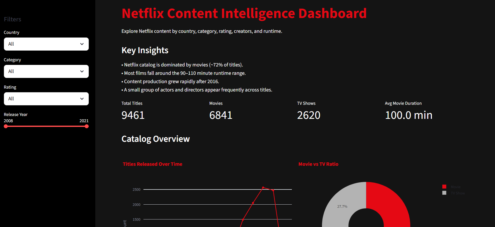

# netflix-content-dashboard
# Netflix Content Intelligence Dashboard

An interactive data visualization dashboard exploring Netflix content patterns across geography, creators, ratings, and runtime.

## Project Overview

Streaming platforms host thousands of titles, making it difficult to understand patterns in content production, audience targeting, and creator influence.

This dashboard analyzes Netflix catalog data to reveal insights about:

- content growth over time
- distribution of movies vs TV shows
- top directors and actors
- country-level production trends
- runtime patterns across ratings

## Dashboard Preview



## Dashboard Features

- Interactive filtering by country, category, rating, and release year
- Real-time chart updates
- Netflix-style dark theme UI
- KPI summary metrics

### Visualizations Included

- Titles released over time
- Movie vs TV show ratio
- Top directors
- Top actors
- Rating distribution
- Country vs category analysis
- Movie runtime distribution
- TV show season distribution
- Rating vs runtime

## Tech Stack

Python  
Pandas  
Plotly  
Streamlit  

## Dataset

Netflix titles dataset containing metadata about movies and TV shows including:

- director
- cast
- country
- release date
- rating
- duration

## Project Structure

```
netflix-dashboard
│
├── app.py
├── netflix_clean.csv
├── requirements.txt
└── README.md
```

## Run Locally

Install dependencies:

```
pip install -r requirements.txt
```

Run the dashboard:

```
streamlit run app.py
```

## Future Improvements

- global map of Netflix content production
- keyword analysis from title descriptions
- genre clustering
- recommendation-style similarity exploration

## Author

Ada Tuana Dönmez  
Minerva University — Data Science & Economics
